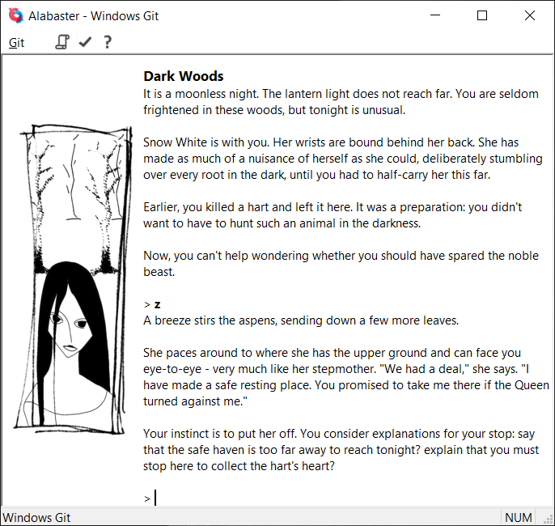

# Git

Git is an interpreter for the [Glulx](https://eblong.com/zarf/glulx/) virtual machine, which is widely used to play interactive fiction (text adventure) games created with [Inform 7](http://inform7.com/).

Git's main goal in life is to be fast. It's about five times faster than [Glulxe](https://github.com/erkyrath/glulxe), and about twice as fast as Frotz (using the same Inform source compiled for the Z-machine). It also tries to be reasonably careful with memory: it's possible to trade speed off against memory by changing the sizes of Git's internal buffers.

To be compiled into a useable program, Git needs to be built against a [Glk](https://eblong.com/zarf/glk/) library to provide it with a user interface. Included with Git are the source files needed to compile against [Windows Glk](https://github.com/DavidKinder/Windows-Glk), and the latest release on this GitHub project also includes a Windows executable build of Git with Windows Glk.

